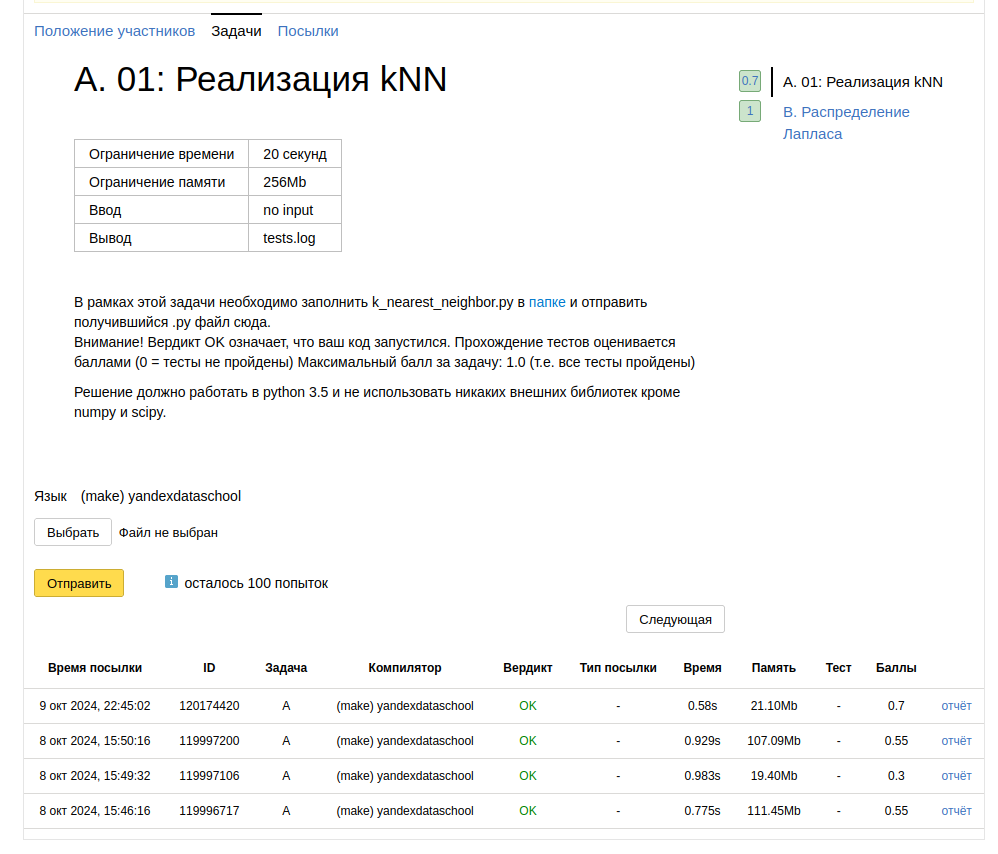

Вот так вот выглядит то, что я заработал. Вообще, печально, многого не знал:

1. Прежде всего было открытием так называемое broadcast sum в, теперь заслуженно моем найлюбимейшем numpy. Быть может,
   конечно, это вот только я вот так учился, что операция разницы между вектором и матрицей у нас не была определена, но
   это просто убер удобно. Сначала вот наломал 100500 дров, используя функцию np.tile чтобы все было "формально"
2. Опять-таки, касаемо numpy я не понимал как работают в нем оси (например, по какому принципу суммирует np(sum(
   axis=1))). Возможно сделаю небольшой туториал в главном канале
3. По правде говоря, я так и не понял, чем недовольна проверка в A; Тем не менее, я долго осмысливал и сам kNN. Мне
   всегда из всех математических дисциплин именно линал казался сложным тем, что заставляет выкручивать воображение на
   максимум. Но, тем не менее, я уже почти привык к этому)
4. В распределении Лапласа я узнал несколько важных моментов из статистики. К сожалению, мы пока что не проходили ее в
   ВУЗе, так что я справляюсь благодаря разъяснениям терминов от GPT и уже имеющихся представлений. Слегка стыдно, но
   это вопрос максимум полугода)

> **Вывод:** numpy — это суперкруто, что еще сказать. Нужно будет внимательно на разборе посмотреть что не так в первом
> задании
