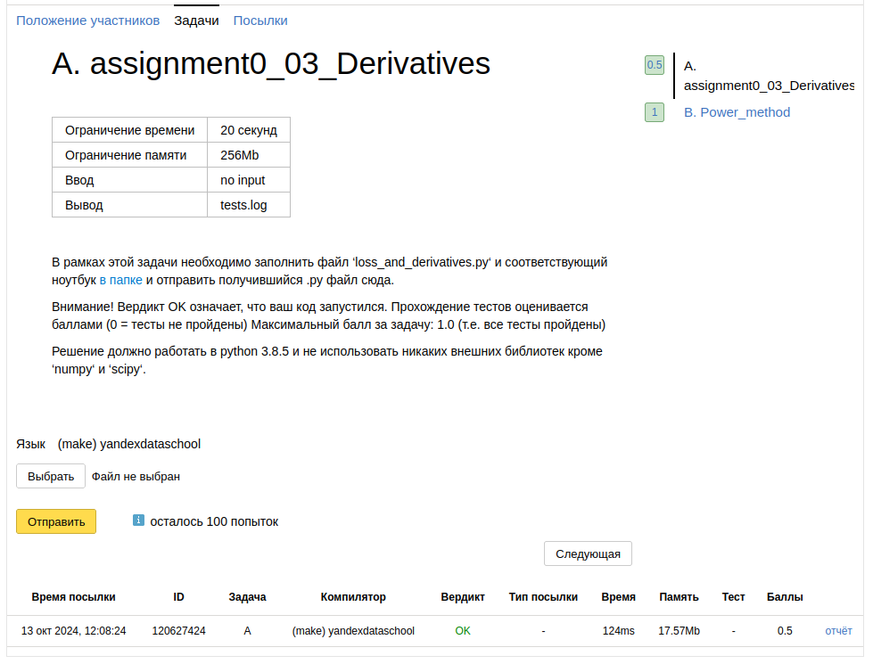

Снова в первом задании что-то не так... Но, что еще важнее, так это то, что нужно разобраться с матричным
дифференцированием. Проблема в том, что это, как я понимаю, проходят на магистратуре (ну или старших курсах где-то),
поэтому нужно будет самому разбираться. Благо, у меня есть знакомые, которые и записи лекций скинут, и дз поделятся

Но гораздо интереснее тут то, что я ужа начал потихоньку стараться применять полученные знания на практике. Ну, или, по
крайней мере, "грокать" их. Вот в прошлом дз есть ноутбук с одного канала, где объясняли регрессию. В нем я кроме этого
проводил и уйму других тестов: рисовал графики, где показывал то, как разделяла пространство признаков на зоны разных
таргетов та или иная модель. И тетировал я так все, что знаю: kNN, наивный Байес, логистическую регрессию, линейную
регрессию, решающее дерево, беггинг и рандом форест. Это была отличная возможность и наглядно сравнить время выполнения
этих функций, протестировать регуляризационные члены и т.д. Более того, таким образом я, побочно, изучил основы
Матплотлиба, к изучению которого никак не мог подобраться раньше
