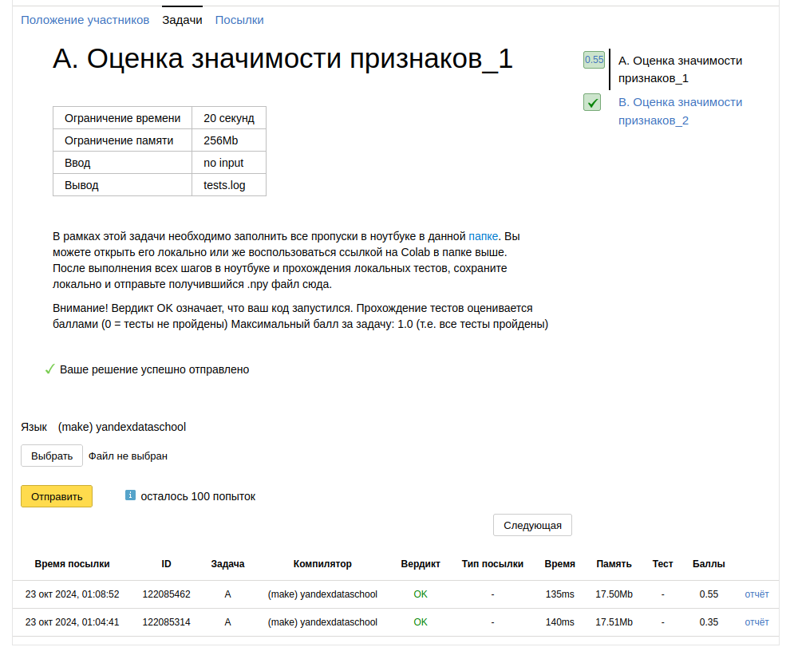

Мне очень понравилось задание. Наверное, одно из самых лучших в этом курсе. Очень понравился и shap: просто крутейшая вещь для анализа значимости признаков
И тем не менее, второе задание мне не засчитало совсем, а первое лишь на половину... Но, как бы там ни был, я понял тему. А это - главное
Так же уже начал потихоньку разбираться и в sklearn, что не может не радовать
